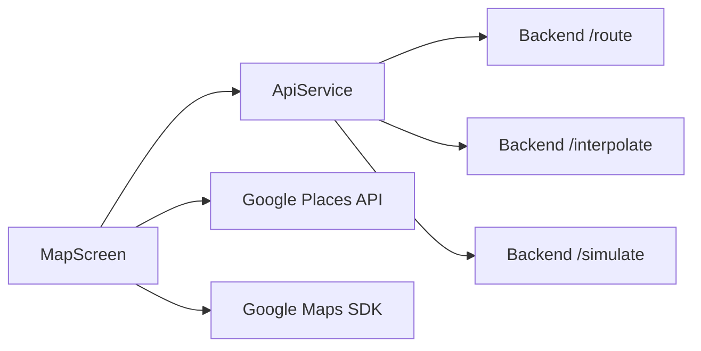

<div align="center">

# Fake GPS — Simulador de Rotas

**App mobile em Flutter para planejar trajetos, interpolar pontos e simular deslocamento em mapa.**

<br/>


<br/>


</div>

---

## Sobre o projeto

Desenvolvi este app para estudar integração **mobile + APIs geoespaciais**: escolher origem e destino no mapa, buscar a rota em um backend próprio, refinar os pontos por interpolação e rodar uma simulação com velocidade configurável — tudo visualizado no **Google Maps**.

É um projeto de portfólio: o código está limpo para clonar e rodar localmente depois de configurar suas próprias chaves (veja [Configuração](#configuração)).

### O que o app faz

| Funcionalidade | Descrição |
|----------------|-----------|
| Busca de endereços | Autocomplete via **Google Places API** |
| Mapa interativo | Marcadores de origem/destino e polylines |
| Cálculo de rota | Consome API REST (`/route`) |
| Interpolação | Densifica pontos da rota (`/interpolate`) |
| Simulação | Anima o “veículo” na rota com velocidade em km/h (`/simulate`) |

---

## Stack

<p align="center">
  
  
  
  
</p>

| Camada | Tecnologia |
|--------|------------|
| UI | Flutter 3 · Material 3 |
| Mapas | `google_maps_flutter` |
| HTTP | `http` |
| Estado | `provider` (estrutura preparada) |
| Backend | API REST externa (Python/FastAPI — repositório separado) |

---

## Arquitetura



---

## Estrutura do repositório

```
lib/
├── config/app_config.dart   # chaves e URL do backend (placeholders)
├── models/point.dart
├── screens/
│   ├── map_screen.dart      # tela principal
│   └── api_test_page.dart   # testes manuais da API
├── services/api_service.dart
└── main.dart
```

---

## Como rodar

### Pré-requisitos

- [Flutter SDK](https://docs.flutter.dev/get-started/install) (Dart 3.9+)
- Dispositivo/emulador Android com Google Play Services
- Chave **Google Maps** + **Places API** habilitadas
- Backend de rotas rodando (porta padrão `8001`)

### Passos

```bash
git clone https://github.com/SEU_USUARIO/fake_gps_app.git
cd fake_gps_app
flutter pub get
```

1. Edite `lib/config/app_config.dart` com sua chave Google e a URL do backend.
2. Atualize a mesma chave em `android/app/src/main/AndroidManifest.xml` (`com.google.android.geo.API_KEY`).
3. Execute:

```bash
flutter run
```

> No emulador Android, `localhost` do host vira `10.0.2.2`. Ex.: `http://10.0.2.2:8001`.

---

## Configuração

Todas as credenciais ficam em **`lib/config/app_config.dart`**:

| Variável | O que é | Onde obter |
|----------|---------|------------|
| `googleMapsApiKey` | Chave Google Cloud (Maps + Places) | [Google Cloud Console](https://console.cloud.google.com/apis/credentials) |
| `apiBaseUrl` | URL base do backend de rotas | Seu servidor local ou deploy |

**Importante:** restrinja a chave Google por pacote Android (`com.example.fake_gps_app`) e por API (Maps SDK, Places).

---

## Endpoints do backend (referência)

| Método | Rota | Uso |
|--------|------|-----|
| `GET` | `/route/?origin=lon,lat&destination=lon,lat` | Pontos da rota |
| `POST` | `/interpolate/` | Body: `{ "points": [...] }` |
| `POST` | `/simulate/` | Body: `{ "points": [...], "speed_kmh": N }` |

A tela `ApiTestPage` existe para validar esses endpoints isoladamente.

---

## Screenshots

> Adicione aqui capturas do app (`docs/screenshots/`) quando for atualizar o portfólio.

<!--

-->

---

## Licença

Projeto de demonstração — uso livre para estudo e referência em portfólio.

---

<div align="center">

Feito com Flutter · projeto de estudo em geolocalização e APIs REST

</div>
